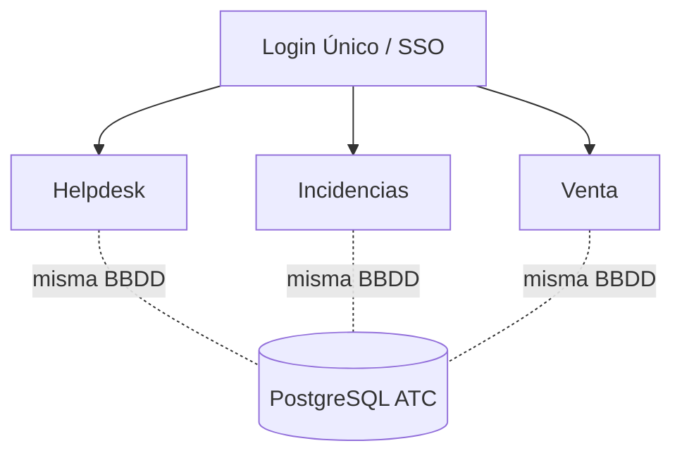

# Visión General · ATC

> [!abstract] Qué es
> Monorepo **FastAPI** de Alguien Te Cuida. Tres módulos conviven en una sola app ([[App Unificada]]) sobre una sola BBDD PostgreSQL (`ATC`). Una sola puerta de entrada con [[Login Único y SSO]].

## Módulos

- **[[Helpdesk]]** (`ATC/app`) — tickets, SLA + feedback, mensajes, solicitantes, correo IMAP/SMTP, paneles, analytics, Celery workers.
- **[[Incidencias]]** (`ATC/incidencias/app`) — registro, clientes, sucursales, protocolos, rendiciones, tareas (migrado de Google Apps Script).
- **[[Venta]]** — venta ODS, finanzas, administración, operaciones.

## Áreas y redirección
Cada usuario tiene un área principal en `[[user_areas]]` que define a qué panel entra. Detalle en [[Login Único y SSO]].

## Base de datos
Helpdesk e Incidencias se unificaron en una sola base `ATC` el 2026-05-20. Ver [[Unificación BBDD]] y el [[MER ATC|modelo de datos]].

## Operaciones
- [[Levantar Servidor]]
- [[Email IMAP-SMTP]]
- [[Celery y Workers]]

## Decisiones
- [[0001 Unificación de BBDD]]
