# MER propuesto profesional

## Entidades principales
- Soporte: `users`, `requesters`, `tickets`, `messages`, historiales, feedback, estados de lectura y automatizaciones.
- Clientes y sucursales: `bbdd_clientes`, `bbdd_sucursales` y tablas dependientes.
- Ventas/ODT: `venta_ods`, archivos y seguimiento por Administracion, Finanzas, Servicio Tecnico y Operaciones.
- Incidencias: `registro`/`incidencias_data`, cierres, imagenes, correos y rendiciones.
- Protocolos: `protocolos_registro` e `protocolos_informes`.

## Cardinalidades
- Uno a muchos: cliente a sucursales, cliente a ODS, requester a tickets, ticket a mensajes, venta_ods a archivos.
- Uno a uno: ticket a feedback SLA, venta_ods a cada seguimiento departamental.
- Muchos a muchos: no hay tablas puente clasicas; los estados de lectura funcionan como puente usuario-ticket.
- Relaciones logicas pendientes: cierres, imagenes, correos y rendiciones por `odt` o `incidencia_id` requieren FK o documentacion explicita.

## Explicacion simple
`||--o{` significa uno a muchos. `||--o|` significa uno a cero/uno. El comentario `"pendiente"` marca una relacion recomendable que aun no esta garantizada fisicamente en PostgreSQL.

## Mermaid ER Diagram

```mermaid
erDiagram
    USERS ||--o{ TICKETS : asigna
    USERS ||--o{ MESSAGES : envia
    USERS ||--o{ TICKET_ASSIGNMENT_HISTORY : cambia
    USERS ||--o{ INTERNAL_CHAT_MESSAGES : envia
    USERS ||--o| INTERNAL_CHAT_READ_STATES : lee
    USERS ||--o{ TICKET_ALERT_READ_STATES : lee
    REQUESTERS ||--o{ TICKETS : solicita
    TICKETS ||--o{ MESSAGES : contiene
    TICKETS ||--o{ TICKET_ASSIGNMENT_HISTORY : registra
    TICKETS ||--o| TICKET_SLA_FEEDBACK : califica
    TICKETS ||--o{ TICKET_SLA_FEEDBACK_EVENTS : audita
    TICKETS ||--o{ TICKET_MESSAGE_READ_STATES : lectura_mensajes
    TICKETS ||--o{ TICKET_INTERNAL_NOTE_READ_STATES : lectura_notas
    TICKETS ||--o{ AUTOMATION_LOGS : automatiza

    BBDD_CLIENTES ||--o{ BBDD_SUCURSALES : posee
    BBDD_SUCURSALES ||--o{ SUCURSAL_CONTACTOS_EMERGENCIA : tiene
    BBDD_SUCURSALES ||--o{ SUCURSAL_PERSONAS_AUTORIZADAS : autoriza
    BBDD_SUCURSALES ||--o{ SUCURSAL_GUARDIAS : asigna
    BBDD_CLIENTES ||--o{ VENTA_ODS : solicita
    VENTA_ODS ||--o{ VENTA_ODS_ARCHIVOS : adjunta
    VENTA_ODS ||--o| ADMINISTRACION_ODT : gestiona
    VENTA_ODS ||--o| FINANZAS_ODT : factura
    VENTA_ODS ||--o| SERVICIO_TECNICO_VENTAS_ODT : instala
    VENTA_ODS ||--o| OPERACIONES_VENTA_ODT : coordina

    PROTOCOLOS_REGISTRO ||--o{ PROTOCOLOS_INFORMES : genera
    INCIDENCIAS_DATA ||--o{ INCIDENCIAS_CIERRES : cierra_logico
    INCIDENCIAS_DATA ||--o| INCIDENCIAS_IMAGENES_ODT : evidencia_logica
    REGISTRO ||--o| INCIDENCIAS_IMAGENES_ODT : evidencia_por_odt
    REGISTRO ||--o{ REGISTROS_CORREOS_CLIENTE : notifica
    REGISTRO ||--o{ RENDICIONES : consume_gastos

    USERS {
        int id PK
        string username UK
        string role
        boolean is_active
    }
    REQUESTERS {
        int id PK
        string email
        string name
    }
    TICKETS {
        int id PK
        int requester_id FK
        int assigned_to_id FK
        string status
        string priority
        timestamp created_at
    }
    MESSAGES {
        int id PK
        int ticket_id FK
        int sender_id FK
        string channel
        timestamp created_at
    }
    TICKET_ASSIGNMENT_HISTORY {
        int id PK
        int ticket_id FK
        int from_user_id FK
        int to_user_id FK
        int changed_by_id FK
    }
    TICKET_SLA_FEEDBACK {
        int ticket_id PK,FK
        int rating
    }
    TICKET_SLA_FEEDBACK_EVENTS {
        int id PK
        int ticket_id FK
        string event_type
    }
    AUTOMATION_LOGS {
        int id PK
        int ticket_id FK
        string rule_key
        string status
    }
    INTERNAL_CHAT_MESSAGES {
        int id PK
        int sender_id FK
        text content
    }
    INTERNAL_CHAT_READ_STATES {
        int user_id PK,FK
        int last_seen_message_id
    }
    TICKET_ALERT_READ_STATES {
        int user_id PK,FK
        int last_seen_alert_id
    }
    TICKET_MESSAGE_READ_STATES {
        int user_id PK,FK
        int ticket_id FK
    }
    TICKET_INTERNAL_NOTE_READ_STATES {
        int user_id PK,FK
        int ticket_id FK
    }
    BBDD_CLIENTES {
        int id PK
        string rut UK
        string cliente UK
    }
    BBDD_SUCURSALES {
        int id PK
        string rut FK
        string nombre_sucursal
        string direccion_sucursal
    }
    SUCURSAL_CONTACTOS_EMERGENCIA {
        int id PK
        int sucursal_id FK
        string nombre
    }
    SUCURSAL_PERSONAS_AUTORIZADAS {
        int id PK
        int sucursal_id FK
        string nombre
    }
    SUCURSAL_GUARDIAS {
        int id PK
        int sucursal_id FK
        string nombre
    }
    VENTA_ODS {
        int id PK
        string codigo UK
        string rut_cliente FK
        string estado
    }
    VENTA_ODS_ARCHIVOS {
        int id PK
        int ods_id FK
        string codigo_ods
    }
    ADMINISTRACION_ODT {
        int id PK
        string odt FK,UK
        boolean finalizado
    }
    FINANZAS_ODT {
        int id PK
        string odt FK,UK
        boolean finalizado
    }
    SERVICIO_TECNICO_VENTAS_ODT {
        int id PK
        string odt FK,UK
        boolean finalizado
    }
    OPERACIONES_VENTA_ODT {
        int id PK
        string odt FK,UK
        boolean terminado
    }
    PROTOCOLOS_REGISTRO {
        int id PK
        string cliente
        string sucursal
        string tipo_protocolo
    }
    PROTOCOLOS_INFORMES {
        int id PK
        int registro_id FK
        string tipo_informe
        string estado
    }
    REGISTRO {
        int id PK
        string odt UK
        string cliente
        string estado
    }
    INCIDENCIAS_DATA {
        int id PK
        string odt
        string cliente
        string estado
    }
    INCIDENCIAS_CIERRES {
        int id PK
        int incidencia_id FK "pendiente"
        string odt
    }
    INCIDENCIAS_IMAGENES_ODT {
        int id PK
        string odt UK
        json imagenes
    }
    REGISTROS_CORREOS_CLIENTE {
        int id PK
        string odt
        string estado
    }
    RENDICIONES {
        int id PK
        int folio UK
        string odt
        numeric monto_total
    }
```

