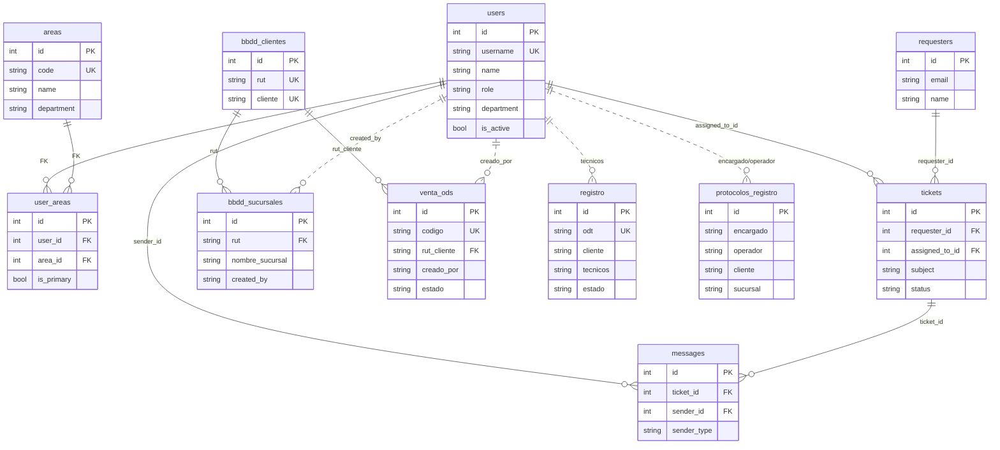

# MER BBDD ATC desde users

Este mapa esta ordenado con `users` como entidad raiz.

- Linea solida: relacion fisica con FK real en PostgreSQL.
- Linea punteada: relacion funcional/inferida por campo de negocio. Ejemplos:
  `created_by`, `usuario_soporte`, `tecnico`, `odt`, `cliente`.

## Vista Mermaid

## Archivos

- MER completo: `docs/database/MER_ATC_DESDE_USERS.mmd`
- Esta vista resumida: `docs/database/MER_ATC_DESDE_USERS.md`

## Orden logico

1. `users`
2. `areas` / `user_areas`
3. Helpdesk: `requesters`, `tickets`, `messages`, historiales, lecturas y SLA
4. Clientes y sucursales
5. Venta ODS y flujo por areas
6. Incidencias operativas
7. Protocolos
8. Integraciones: correo, outbox y sincronizacion

