# Mapa Entidad-Relacion Final - Sistema ATC

## Explicacion del sistema
El sistema ATC combina gestion de soporte, clientes, sucursales, ordenes de trabajo/servicio, incidencias, protocolos, evidencias, rendiciones y automatizaciones. Este MER presenta las entidades principales y sus relaciones de negocio mas relevantes.

## Entidades principales
- `users`: usuarios internos del sistema.
- `areas` y `user_areas`: catalogo de areas/departamentos y pertenencia de usuarios para evitar cruces de acceso.
- `requesters`: solicitantes o clientes que originan tickets.
- `tickets` y `messages`: nucleo de atencion y conversacion.
- `bbdd_clientes` y `bbdd_sucursales`: maestro de clientes y ubicaciones.
- `venta_ods`: orden de servicio/venta principal.
- `administracion_odt`, `finanzas_odt`, `servicio_tecnico_ventas_odt`, `operaciones_venta_odt`: seguimiento por area.
- `registro` / `incidencias_data`: registros operativos de incidencias.
- `protocolos_registro` y `protocolos_informes`: control e informes de protocolos.
- `rendiciones`, `incidencias_imagenes_odt`, `registros_correos_cliente`: evidencias y trazabilidad.

## Relaciones principales y cardinalidades
- Un usuario puede tener muchos tickets asignados y muchos mensajes enviados.
- Un usuario puede pertenecer a muchas areas mediante `user_areas`; cada area pertenece a un departamento operativo.
- Un solicitante puede tener muchos tickets.
- Un ticket puede contener muchos mensajes, eventos, historiales y logs de automatizacion.
- Un cliente puede tener muchas sucursales y muchas ODT.
- Una sucursal puede tener muchos contactos, personas autorizadas y guardias.
- Una ODT puede tener muchos archivos y un seguimiento por cada area operativa.
- Un protocolo puede generar muchos informes.
- Una incidencia puede tener cierres, evidencias, correos y rendiciones asociadas de forma logica por `id` u `odt`.

## Diagrama Mermaid ER

```mermaid
erDiagram
    USERS ||--o{ TICKETS : asigna
    USERS ||--o{ MESSAGES : envia
    USERS ||--o{ TICKET_ASSIGNMENT_HISTORY : cambia
    USERS ||--o{ INTERNAL_CHAT_MESSAGES : envia
    USERS ||--o| INTERNAL_CHAT_READ_STATES : lee
    USERS ||--o{ TICKET_ALERT_READ_STATES : lee
    USERS ||--o{ USER_AREAS : pertenece
    AREAS ||--o{ USER_AREAS : agrupa
    REQUESTERS ||--o{ TICKETS : solicita
    TICKETS ||--o{ MESSAGES : contiene
    TICKETS ||--o{ TICKET_ASSIGNMENT_HISTORY : registra
    TICKETS ||--o| TICKET_SLA_FEEDBACK : califica
    TICKETS ||--o{ TICKET_SLA_FEEDBACK_EVENTS : audita
    TICKETS ||--o{ TICKET_MESSAGE_READ_STATES : lectura_mensajes
    TICKETS ||--o{ TICKET_INTERNAL_NOTE_READ_STATES : lectura_notas
    TICKETS ||--o{ AUTOMATION_LOGS : automatiza

    BBDD_CLIENTES ||--o{ BBDD_SUCURSALES : posee
    BBDD_SUCURSALES ||--o{ SUCURSAL_CONTACTOS_EMERGENCIA : tiene
    BBDD_SUCURSALES ||--o{ SUCURSAL_PERSONAS_AUTORIZADAS : autoriza
    BBDD_SUCURSALES ||--o{ SUCURSAL_GUARDIAS : asigna
    BBDD_CLIENTES ||--o{ VENTA_ODS : solicita
    VENTA_ODS ||--o{ VENTA_ODS_ARCHIVOS : adjunta
    VENTA_ODS ||--o| ADMINISTRACION_ODT : gestiona
    VENTA_ODS ||--o| FINANZAS_ODT : factura
    VENTA_ODS ||--o| SERVICIO_TECNICO_VENTAS_ODT : instala
    VENTA_ODS ||--o| OPERACIONES_VENTA_ODT : coordina

    PROTOCOLOS_REGISTRO ||--o{ PROTOCOLOS_INFORMES : genera
    REGISTRO ||--o{ INCIDENCIAS_CIERRES : cierra_logico
    REGISTRO ||--o| INCIDENCIAS_IMAGENES_ODT : evidencia_logica
    REGISTRO ||--o{ REGISTROS_CORREOS_CLIENTE : notifica_logica
    REGISTRO ||--o{ RENDICIONES : consume_gastos

    USERS {
        int id PK
        string username UK
        string name
        string role
        string department
        boolean is_active
    }
    AREAS {
        int id PK
        string code UK
        string name UK
        string department
        boolean is_active
    }
    USER_AREAS {
        int id PK
        int user_id FK
        int area_id FK
        string department
        boolean is_primary
    }
    REQUESTERS {
        int id PK
        string email
        string name
    }
    TICKETS {
        int id PK
        int requester_id FK
        int assigned_to_id FK
        string status
        string priority
        timestamp created_at
    }
    MESSAGES {
        int id PK
        int ticket_id FK
        int sender_id FK
        string channel
        timestamp created_at
    }
    TICKET_ASSIGNMENT_HISTORY {
        int id PK
        int ticket_id FK
        int from_user_id FK
        int to_user_id FK
        int changed_by_id FK
    }
    TICKET_SLA_FEEDBACK {
        int ticket_id PK,FK
        int rating
    }
    TICKET_SLA_FEEDBACK_EVENTS {
        int id PK
        int ticket_id FK
        string event_type
    }
    AUTOMATION_LOGS {
        int id PK
        int ticket_id FK
        string rule_key
        string status
    }
    INTERNAL_CHAT_MESSAGES {
        int id PK
        int sender_id FK
        text content
    }
    INTERNAL_CHAT_READ_STATES {
        int user_id PK,FK
        int last_seen_message_id
    }
    TICKET_ALERT_READ_STATES {
        int user_id PK,FK
        int last_seen_alert_id
    }
    TICKET_MESSAGE_READ_STATES {
        int user_id PK,FK
        int ticket_id FK
    }
    TICKET_INTERNAL_NOTE_READ_STATES {
        int user_id PK,FK
        int ticket_id FK
    }
    BBDD_CLIENTES {
        int id PK
        string rut UK
        string cliente UK
    }
    BBDD_SUCURSALES {
        int id PK
        string rut FK
        string nombre_sucursal
        string direccion_sucursal
    }
    SUCURSAL_CONTACTOS_EMERGENCIA {
        int id PK
        int sucursal_id FK
        string nombre
    }
    SUCURSAL_PERSONAS_AUTORIZADAS {
        int id PK
        int sucursal_id FK
        string nombre
    }
    SUCURSAL_GUARDIAS {
        int id PK
        int sucursal_id FK
        string nombre
    }
    VENTA_ODS {
        int id PK
        string codigo UK
        string rut_cliente FK
        string estado
    }
    VENTA_ODS_ARCHIVOS {
        int id PK
        int ods_id FK
        string codigo_ods
    }
    ADMINISTRACION_ODT {
        int id PK
        string odt FK,UK
        boolean finalizado
    }
    FINANZAS_ODT {
        int id PK
        string odt FK,UK
        boolean finalizado
    }
    SERVICIO_TECNICO_VENTAS_ODT {
        int id PK
        string odt FK,UK
        boolean finalizado
    }
    OPERACIONES_VENTA_ODT {
        int id PK
        string odt FK,UK
        boolean terminado
    }
    PROTOCOLOS_REGISTRO {
        int id PK
        string cliente
        string sucursal
        string tipo_protocolo
    }
    PROTOCOLOS_INFORMES {
        int id PK
        int registro_id FK
        string tipo_informe
        string estado
    }
    REGISTRO {
        int id PK
        string odt UK
        string cliente
        string estado
    }
    INCIDENCIAS_DATA {
        int id PK
        string odt
        string cliente
        string estado
    }
    INCIDENCIAS_CIERRES {
        int id PK
        int incidencia_id FK "pendiente"
        string odt
    }
    INCIDENCIAS_IMAGENES_ODT {
        int id PK
        string odt UK
        json imagenes
    }
    REGISTROS_CORREOS_CLIENTE {
        int id PK
        string odt
        string estado
    }
    RENDICIONES {
        int id PK
        int folio UK
        string odt
        numeric monto_total
    }
```

## Como leer el diagrama
`||--o{` significa uno a muchos. `||--o|` significa uno a cero/uno. `PK` identifica la tabla; `FK` apunta a otra tabla; `UK` indica valor unico. Las relaciones etiquetadas como `cierra_logico`, `evidencia_logica` o `notifica_logica` siguen pendientes de formalizacion con FK.

## Observaciones finales
Este MER vuelve a quedar sin la FK fisica `registro -> incidencias_cierres`, porque la reversion SQL retiro cualquier constraint/indice asociado a `fk_incidencias_cierres_registro` e `ix_incidencias_cierres_incidencia_id`. Conserva salvedades tecnicas: existen tablas reales sin modelo, una tabla modelada sin tabla fisica en `helpdesk`, y las relaciones por ODT hacia `incidencias_imagenes_odt` y `registros_correos_cliente` siguen pendientes por datos huerfanos.
